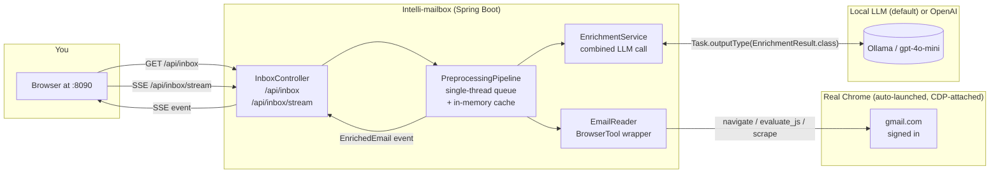

# Intelli-mailbox

> AI-preprocessed inbox on top of your real Gmail. Local LLM by default — emails never leave your laptop.

A Spring Boot web app that reads your Gmail through a CDP-attached real Chrome, then runs every visible email through a local LLM in the background. As each email finishes analysis, the UI updates live over SSE with **multi-category badges** and **structured action items** (with due dates, priority, and source quotes).

## What's different from a generic inbox triage tool

* **Preprocessing, not on-click**: open the app and analysis starts automatically. You see badges and CTAs as soon as the LLM finishes each email — you don't click "Analyze" per row.
* **Multi-category badges** instead of a single urgency rating: `MEETING`, `RISK`, `EXTERNAL`, `AUTOMATED`, `VIP`, `FOLLOW_UP`, `NEWSLETTER`, `FINANCE`. Click any badge to filter the inbox.
* **Structured CTAs**: each action item carries a type (`REPLY` / `REVIEW` / `SCHEDULE` / `PAY` / `SUBMIT` / `READ` / `OTHER`), a priority (`LOW` / `MEDIUM` / `HIGH`), an optional ISO due date (overdue ones are highlighted), and a verbatim source quote from the email so you can audit the LLM.
* **Two themes**: an Intelliswarm dark palette (default) and a clean light theme. Toggle in the header, persisted in `localStorage`.
* **Local-by-default LLM**: ships configured for Ollama on `localhost:11434`. Add `SPRING_PROFILES_ACTIVE=openai-mini OPENAI_API_KEY=…` to use `gpt-4o-mini` instead.

## Quick start

```bash
./run.sh
```

On first run:
1. The app launches a dedicated Chrome at `~/.intelliswarm/intellimailbox-chrome`.
2. Sign in to Gmail in that Chrome window.
3. The Intelli-mailbox UI auto-opens at `http://localhost:8090/` in a new tab.
4. Click **↻ Refresh inbox**. The inbox listing renders immediately; badges and CTAs stream in as each email is analyzed.

To use OpenAI instead of local Ollama:
```bash
SPRING_PROFILES_ACTIVE=openai-mini OPENAI_API_KEY=sk-… ./run.sh
```

## Architecture



* `EmailReader` — scrapes the inbox listing and a single email body via `BrowserTool`.
* `PreprocessingPipeline` — single-thread executor (BrowserTool drives one Chrome page, no parallelism), in-memory cache keyed by inbox-position id, fan-out to SSE subscribers.
* `EnrichmentService` — one LLM call per email returns `{summary, badges, ctas, phishingSuspected}` via Spring AI's structured output.
* `InboxController` — REST + SSE. The SSE endpoint replays the cache on connect so a late-arriving client sees the full state.

## REST + SSE API

| Endpoint | Method | Purpose |
|---|---|---|
| `/api/inbox` | GET | Scrape Gmail, return `InboxItem[]`, queue any uncached rows for enrichment |
| `/api/inbox/stream` | GET (SSE) | Stream of `EnrichedEmail` events as enrichment completes; replays cache on connect |
| `/api/email/{id}/reprocess` | POST | Force re-enrichment of one row |
| `/api/health` | GET | Liveness + cached-row count |

## LLM provider matrix

| Profile | Cost | Latency per email | Data leaves laptop? | When to use |
|---|---|---|---|---|
| `ollama` (default) | $0 | 30–90 s on CPU, 2–4 s on GPU | **No** | Personal email, work inboxes with confidential subjects |
| `openai-mini` | ~$0.0005/email | 2–5 s | Yes — first 4,000 chars per email | Demos, large inboxes, no privacy concerns |

## Layout

```
intellimailbox/
├── pom.xml
├── run.sh
└── src/main/
    ├── java/ai/intelliswarm/intellimailbox/
    │   ├── IntelliMailboxApplication.java       Spring Boot main + Chrome attach orchestration
    │   ├── gmail/
    │   │   ├── RealChromeLauncher.java           Locate + spawn real Chrome with CDP
    │   │   └── EmailReader.java                  BrowserTool wrapper: list inbox, read email body
    │   ├── enrichment/
    │   │   ├── Badge.java                        8-category enum
    │   │   ├── CtaType.java, Priority.java       enums
    │   │   ├── Cta.java                          structured action item record
    │   │   ├── EnrichmentResult.java             raw LLM output POJO
    │   │   ├── EnrichedEmail.java                final aggregate the UI renders
    │   │   └── EnrichmentService.java            combined LLM call (summary + badges + CTAs)
    │   ├── pipeline/
    │   │   ├── InboxItem.java                    inbox-row record
    │   │   └── PreprocessingPipeline.java        async worker + cache + SSE fan-out
    │   └── web/
    │       └── InboxController.java              REST + SSE
    └── resources/
        ├── application.yml                       defaults (web on :8090, BrowserTool attach)
        ├── application-ollama.yml                local LLM (default)
        ├── application-openai-mini.yml           cloud LLM opt-in
        └── static/index.html                     two-theme UI (Intelliswarm dark / Light)
```

## Trade-offs honestly

* **Inbox scraping is selector-based**: Gmail rotates CSS classes (`bog`, `y2`, `xW`, `zE`, …) every few quarters. If a Google update breaks the listing, fix the selectors in `EmailReader.java`.
* **Sequential per-email**: BrowserTool drives one Chrome page, so we can't open many emails in parallel. For 25 emails on local Ollama (CPU), expect 10–30 minutes; on `openai-mini` ~1 minute.
* **No persistence**: enrichment cache is in-memory only. Restart the app and the next refresh re-pays the LLM cost.
* **Read-only**: no mark-as-read / archive / reply / send actions. By design, for safety on a first pass.

## Roadmap

* Quick-reply drafts (3 tones), inspired by `enterprise-mailbox-assistant`'s `generate_quick_reply_drafts`.
* RAG enrichment from a local KB via the framework's vector-store starters.
* Persistence (JDBC + H2) so the cache survives restarts.
* Per-email phishing sub-classification (`authority_scam`, `credential_harvesting`, …).
"# intelli-mailbox" 
